# 🧠 The Astronomists

> *"The most dangerous phrase in the language is: 'We've always done it this way.'"* - Grace Hopper, PhD

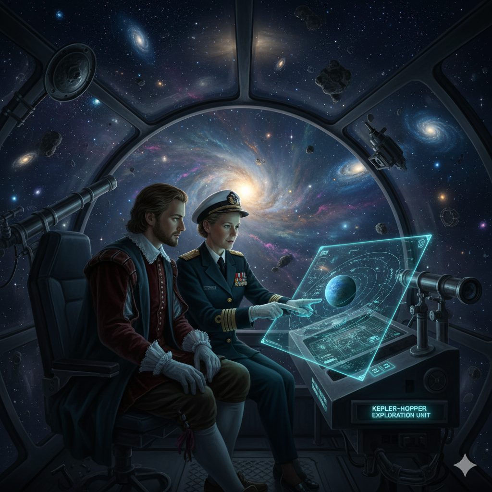

🌍 NASA missions such as Kepler, K2, and TESS have produced massive datasets of stellar observations, yet exoplanet identification remains slow and mostly manual. The main challenge lies in the inconsistencies between missions — varying data formats, feature sets, and noise levels make it difficult to train a single model that performs well across all sources. 

🌌 The Astronomists introduces an agentic AI framework where intelligent agents orchestrate traditional machine learning models, scientific archives, and research literature to accelerate discovery. Two agents — Johannes Kepler and Grace Hopper — collaborate to harmonize data and evaluate classifiers, and cross-check findings with the NASA Exoplanet Archive and open science studies. The system is deployed as an interactive web platform that combines generative AI, traditional ML and 3D visualizations, using Nasa Eyes, allowing beginners to explore, understand, and visualize exoplanet data. 

🐍 Data scientists and ML engineers can upload data, run analyses, and explore planetary systems using integrated Jupyter notebooks — either their own or the ones provided within the platform. We offer several pretrained models, but users can also bring their own, fine-tune them, and evaluate performance through accuracy scores and detailed metrics.

We've created a full-stack web application that unites machine learning, agentic reasoning, and immersive visualization for exoplanet discovery and analysis. Built for the NASA Space Apps Challenge, this project honors Grace Hopper's legacy of curiosity, courage, and the drive to go beyond what has always been done.

## 🎥 Live Demo

You can watch the full walkthrough on YouTube:

[](https://www.youtube.com/watch?v=imL7TtxZxIg)

*(Click the image to open the live demo video on YouTube)*

## 📸 Website Preview

| Page Name | Preview | Description |
|-----------|---------|-------------|
| **Home Page** | 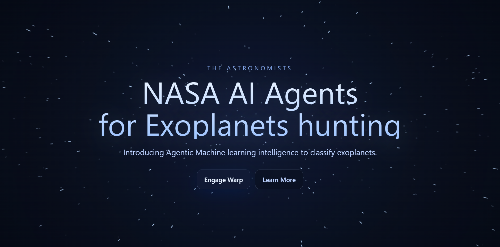 | Immersive space-themed interface with starfield animation |
| **Exploration Path** | 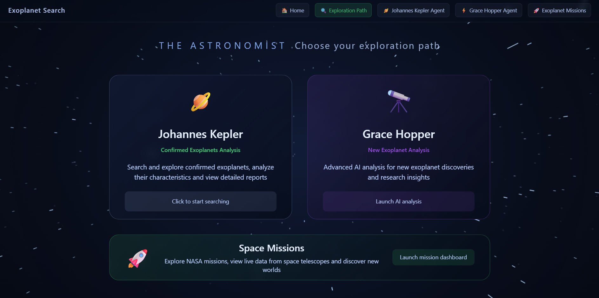 | Central hub for selecting AI agents (Kepler, Grace Hopper, Mission Dashboard) |
| **Grace Hopper Input** | 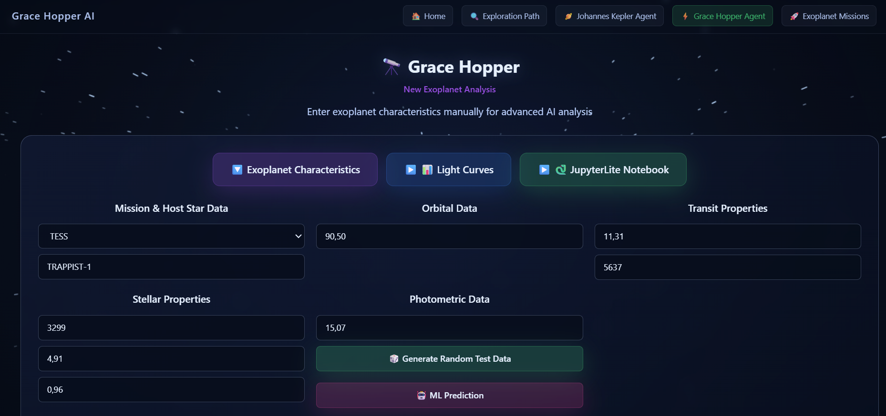 | Interactive analysis interface for candidate exoplanets with ML predictions |
| **Grace Hopper Light Curves** | 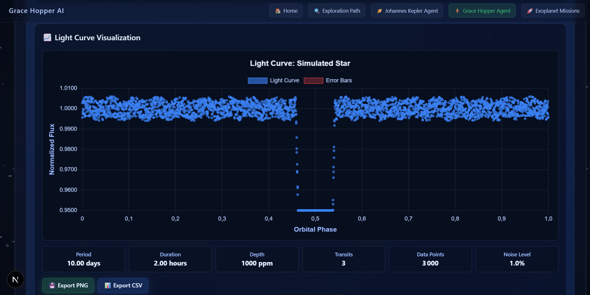 | Transit data analysis with AstronetCNN deep learning model |
| **Grace Hopper Report** | 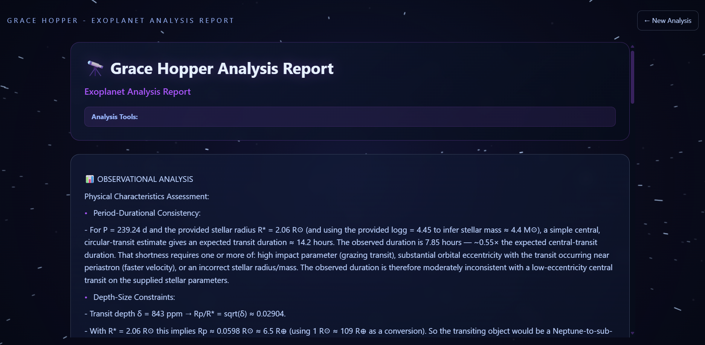 | AI-powered synthesis and contextualized exoplanet analysis |
| **Kepler Input** | 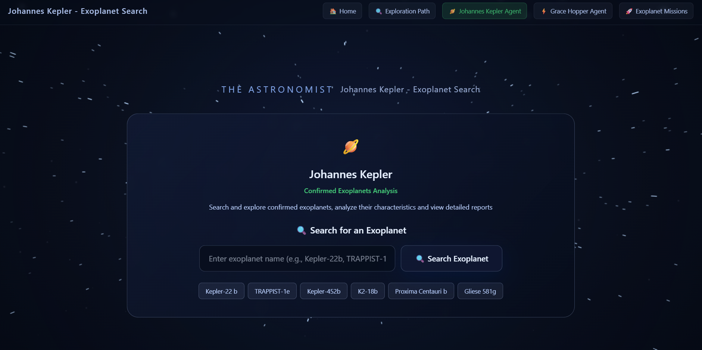 | Search interface for confirmed exoplanets with intelligent search engine |
| **Kepler Planet Results** | 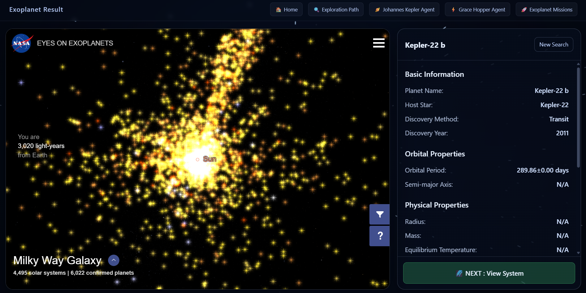 | Exoplanet analysis dashboard with NASA Eyes visualizations |
| **Kepler Planet Results (View 2)** | 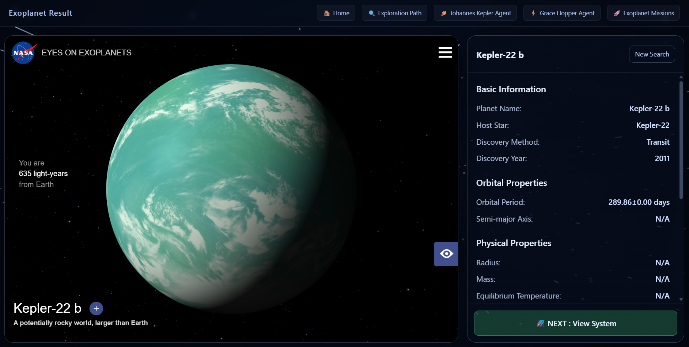 | Alternative view of exoplanet analysis dashboard |
| **Kepler System Viewer** | 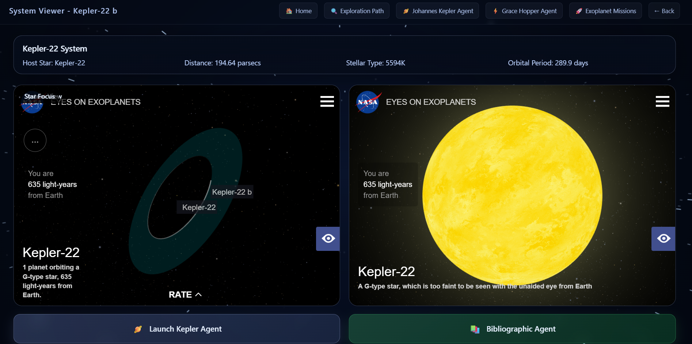 | Stellar system viewer with dual NASA Eyes perspectives |
| **Kepler Bibliographic Research** | 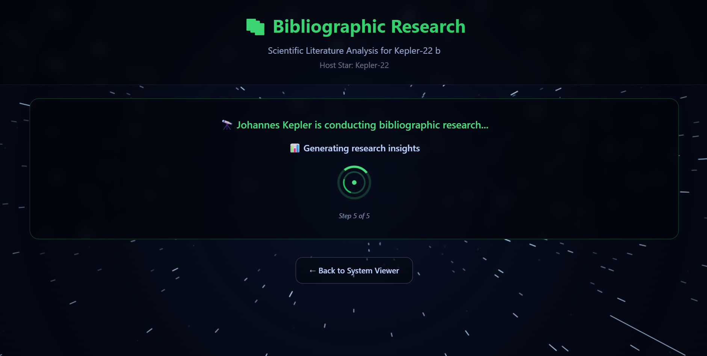 | AI agent for scientific literature analysis via arXiv and publications |
| **Kepler Bibliographic Research (View 2)** | 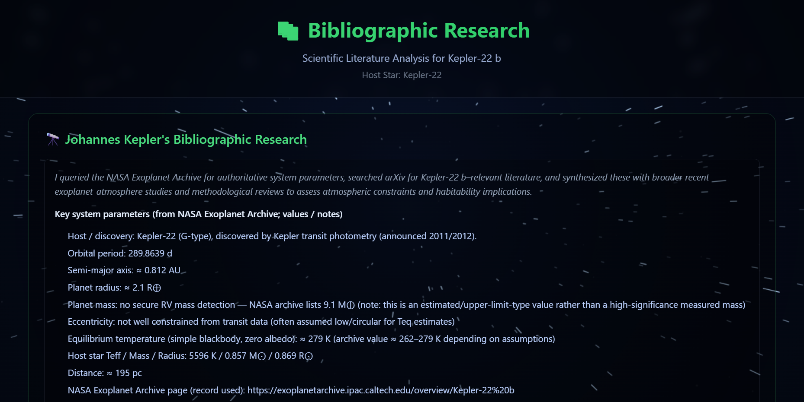 | Alternative view of bibliographic research interface |
| **Kepler Agent Report** | 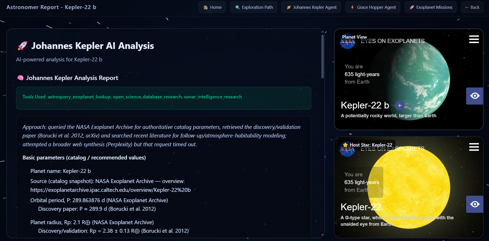 | Automated scientific report and interactive chat from Johannes Kepler AI agent |
| **Kepler Agent Report (View 2)** | 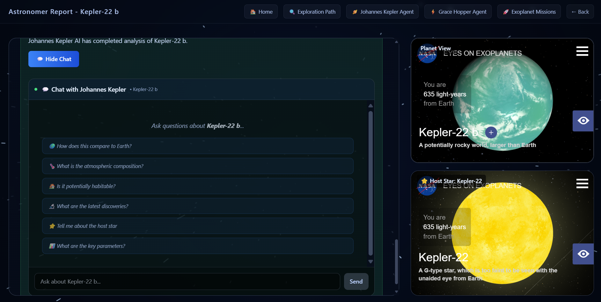 | Alternative view of Kepler agent report interface |
| **Mission Dashboard** | 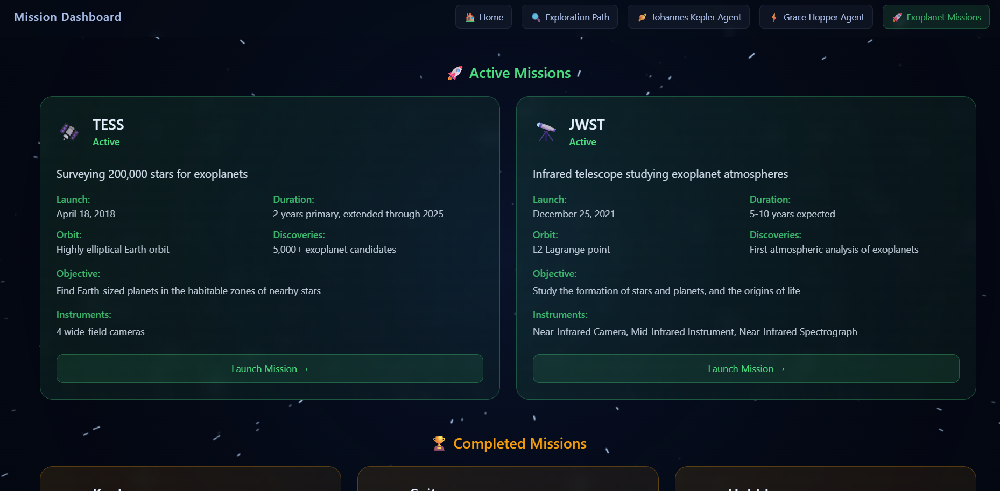 | Mission control center for NASA's space observatories |
| **Mission JWST** | 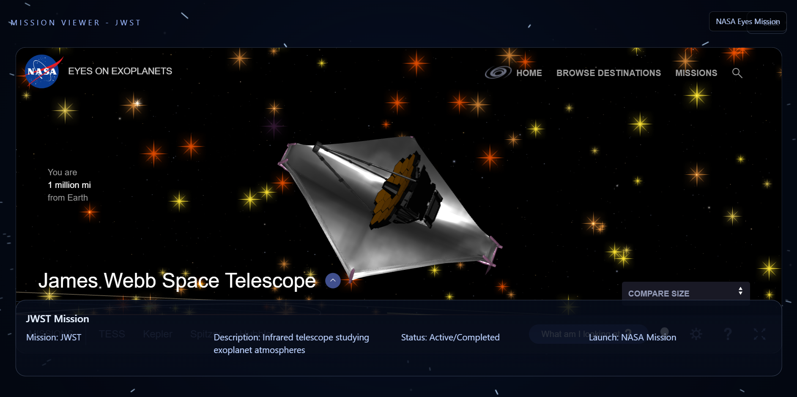 | James Webb Space Telescope mission visualization |


## 🌟 Key Features

### 🤖 **Dual AI Agents**
- **Grace Hopper Agent** - Advanced analysis of new exoplanet candidates with ML predictions
- **Johannes Kepler Agent** - Deep exploration of confirmed exoplanets with scientific literature research

### 🔬 **Machine Learning Pipeline**
- **HistGradientBoostingClassifier** - 83.1% F1-score for exoplanet classification
- **AstronetCNN** - Deep learning model for light curve analysis (65% F1-score)
- **Real-time predictions** - Instant analysis of orbital and stellar parameters

### 🛸 **Three Exploration Paths**

#### **Path 1: New Exoplanet Discovery**
- 📊 **Tabular Data Analysis** - Upload orbital parameters for ML classification
- 📈 **Light Curve Analysis** - Upload transit data for AstronetCNN processing
- 📓 **Integrated Jupyter Notebooks** - Interactive data exploration and model training

#### **Path 2: Confirmed Exoplanet Research**
- 🔍 **Intelligent Search** - Quick access to famous exoplanets (Kepler-22b, TRAPPIST-1e, etc.)
- 🌌 **3D Visualizations** - NASA Eyes integration for immersive system exploration
- 📚 **Bibliographic Research** - AI-powered literature analysis via arXiv and publications
- 💬 **Interactive Reports** - Automated scientific analysis with real-time chat

#### **Path 3: NASA Mission Exploration**
- 🚀 **Mission Dashboard** - Complete catalog of space observatories (TESS, JWST, Kepler, etc.)
- 🛰️ **Real-time Mission Tracking** - Live spacecraft and telescope visualization

### 🎨 **Immersive User Experience**
- ✨ **Space-themed Interface** - Futuristic design with starfield animations
- 📱 **Responsive Design** - Optimized for desktop, tablet, and mobile
- 🌐 **NASA Eyes Integration** - Direct embedding of official NASA visualizations

## 🏗️ Project Architecture

The Astronomist is a full-stack web application developed for the NASA Space Apps Challenge, addressing the task of automatic exoplanet identification using artificial intelligence and machine learning.

### Backend
Built with **FastAPI**, a modern Python web framework enabling efficient integration with specialized AI agents. The backend handles user requests, authentication, and the core exoplanet data analysis pipeline, orchestrated through two agents: Johannes Kepler and Grace Hopper.

### Frontend
Developed as a responsive web application using **Next.js 15**, **TypeScript**, and **Tailwind CSS**, optimized for desktop, tablet, and mobile devices. The interface features a futuristic spatial theme with hyperspace starfield animations and interactive 3D exoplanet visualizations, directly using NASA Eyes embedded on the pages.

### Data Integration
Connected to the **NASA Exoplanet Archive** via astroquery to retrieve and process satellite datasets from the Kepler, K2, and TESS missions. The system also integrates **arXiv** for scientific literature and **Perplexity AI** for intelligent synthesis of web-based knowledge.

### Machine Learning Models
- **HistGradientBoostingClassifier** with an advanced preprocessing pipeline, trained on NASA's open datasets. The model achieves an F1 score of **83.1%** in three-class classification (confirmed exoplanets, planetary candidates, false positives), validated through cross-mission testing.
- **AstronetCNN** deep learning algorithm trained on KOI data, used to classify light curves, achieving an F1-score of **65%**.

### Specialized AI Agents
Two distinct agents powered by the **OpenAI Agents framework**:
- **Johannes Kepler** - for in-depth analysis of NASA data and bibliographic research
- **Grace Hopper** - for advanced exploration combining literature review, web intelligence, and support for JWST image uploads and transit data

## 🚀 Getting Started

### Prerequisites
- Python 3.8+
- Node.js 18+
- npm or yarn

### Installation

1. **Clone the repository**
   ```bash
   git clone https://github.com/your-username/astronomist.git
   cd astronomist
   ```

2. **Backend Setup**
   ```bash
   cd ai_agents
   pip install -r requirements.txt
   cp env.example .env
   # Configure your environment variables
   python start_api.py
   ```

3. **Frontend Setup**
   ```bash
   cd the-astronomist
   npm install
   npm run dev
   ```

4. **Access the application**
   - Frontend: http://localhost:3000
   - Backend API: http://localhost:8000

## 📊 Performance Metrics

- **HistGradientBoostingClassifier**: F1-score of 83.1%
- **AstronetCNN**: F1-score of 65%
- Cross-mission validation completed
- Real-time analysis capabilities

## 🔮 Next Steps

This project represents a first draft, designed to make the discovery and study of exoplanets more accessible. The next phase involves:

- **Collaborating with exoplanet scientists** to curate a comprehensive set of high-quality scientific resources
- **Fine-tuning or distilling open-source models** (e.g., using a LoRA approach) to improve accuracy and reliability
- **Exploring integration of Granite 4 from IBM** as a foundation model to enhance the precision and contextual reasoning of our agents
- **Integrating multiple ML models** into the application, allowing users to select which model to apply when making predictions
- **Supporting benchmarking and reproducibility** while fostering collaborative experimentation

*Next: James Webb integration (if we're lucky to win! 😄)*

## 📄 License

This project is developed for the NASA Space Apps Challenge and is open source.

## 🙏 Acknowledgments

- **NASA** for providing the datasets and APIs
- **Grace Hopper** for inspiring us to push beyond conventional boundaries
- **The exoplanet research community** for their invaluable contributions to our understanding of the universe

---

*Built with ❤️ by Paul Barbaste and Xavier Vasques for the NASA Space Apps Challenge - Hunting for exoplanets*
